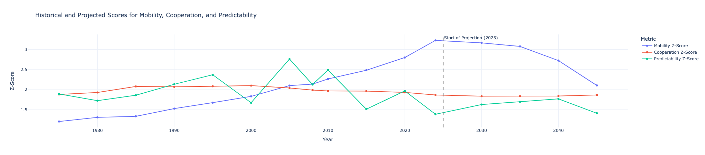
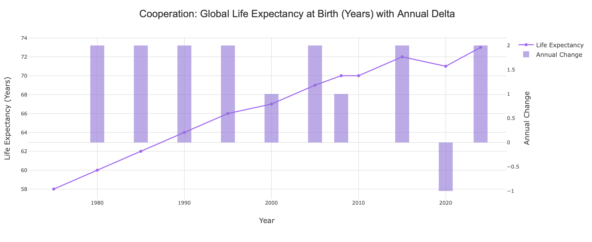
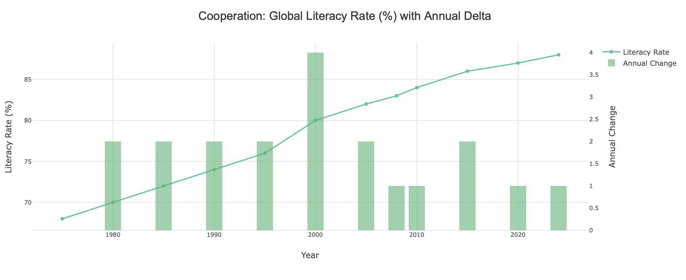
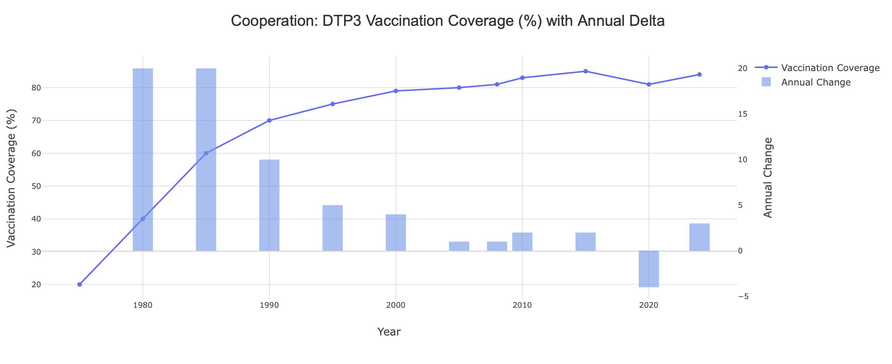
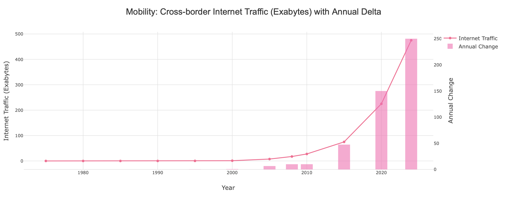
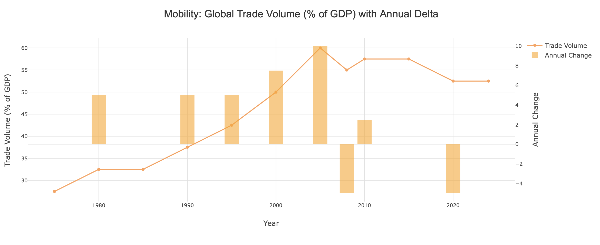
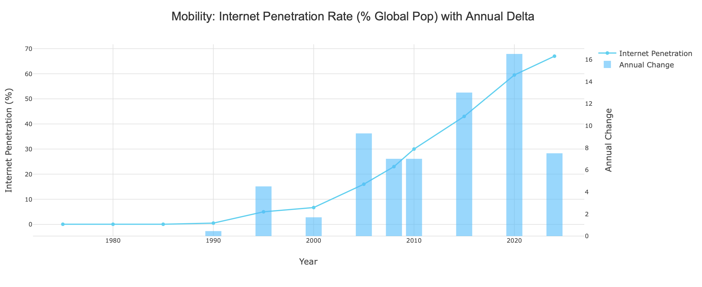
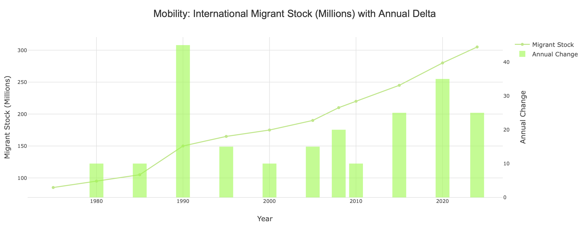
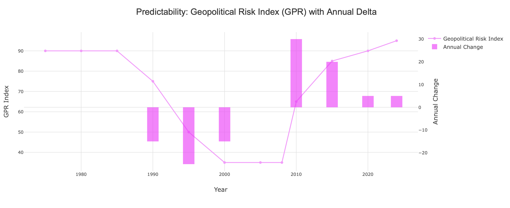
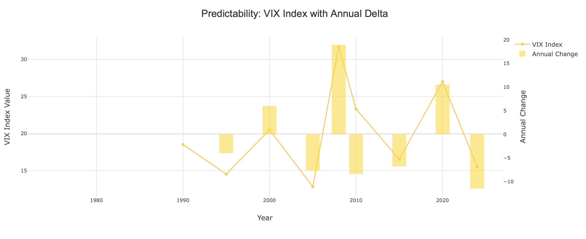

## Modern Mercantilism: Thesis Statements

### 1. A Non-Regional War Could Emerge in the 2040s
Predictability initially improves but then declines sharply around 2040, signaling a period of increased volatility and risk. This dip may indicate rising geopolitical tensions or global instability, potentially culminating in a non-regional conflict before by 2045.

### 2. Global Mobility Has Peaked and Is Now Declining
After a phase of rapid growth, global mobility metrics show signs of contraction. This trend suggests growing barriers to international movement and trade, with implications for global economic integration.

### 3. Human Cooperation Remains Stable Despite Declining Mobility
While global mobility is decreasing, cooperation metrics remain steady. This resilience indicates that nations are adapting and maintaining collaborative efforts even in the face of reduced physical connectivity.

    

    

## Implementation Notes

Signal processing and forecasting techniques are applied to analyze the Z-scores of Mobility, Cooperation, and Predictability. The results are visualized to identify trends and potential future scenarios.

### What is mobility, cooperation, and predictability?
Mobility refers to the ease of movement across borders, including trade and migration. 
Cooperation encompasses collaborative efforts between nations, such as treaties and partnerships. 
Predictability relates to the stability and reliability of international relations and economic conditions.

### Why use these paradigms?
These paradigms are essential for understanding global dynamics. Mobility metrics help assess economic interdependence, cooperation signals indicate the strength of international relationships, and predictability metrics provide insights into geopolitical stability. Together, they offer a comprehensive view of the current and future state of global interactions.


### The Signals used in this analysis are:
- Cooperation Metrics
    - DTP3 Vaccination Coverage (%)
    - Annual CO2 Emissions (Gigatons)
    - Global Literacy Rate (%)
    - Global Life Expectancy (Years)
- Mobility Metrics
    - Global Trade Volume (% of GDP)
    - Internet Penetration Rate (% Global Pop)
    - Cross-border Internet Traffic (Exabytes)
    - International Migrant Stock (Millions)
-  Predictability Metrics
    - Geopolitical Risk Index (GPR)
    - SPY Volatility (%)

Methodology:
1. **Data Preparation**: Load the dataset and calculate Z-scores for each signal.
2. **GARCH Modeling**: Fit GARCH models to the Z-scores of Mobility, Cooperation, and Predictability to capture volatility and trends.
3. **LSTM Forecasting**: Use LSTM networks to predict future values of the Z-scores based on historical data.
4. **Visualization**: Plot the Z-scores, GARCH forecasts, and LSTM predictions to visualize trends and potential future scenarios.
5. **Analysis**: Interpret the results to draw conclusions about the future of global mobility, cooperation, and predictability.


```python
!pip install pandas numpy scipy arch scikit-learn tensorflow matplotlib seaborn ipython
import pandas as pd
import numpy as np
from scipy.stats import zscore # Import zscore function
from arch import arch_model
from sklearn.preprocessing import MinMaxScaler
from tensorflow.keras.models import Sequential
from tensorflow.keras.layers import LSTM, Dense
from tensorflow.keras.callbacks import ModelCheckpoint
import matplotlib.pyplot as plt
import seaborn as sns
from IPython.display import Image

print("Libraries imported successfully.")

```


    

    


    

    


    

    


    

    


    

    


    

    


    

    


    

    


    

    


    

    


## 1. Setup and Data Initialization

The Z-scores for Cooperation, Mobility, and Predictability are calculated here, which will then be used for GARCH and LSTM modeling.


```python

# Provided data (from research1.ipynb)
data = {
    'Year': [1975, 1980, 1985, 1990, 1995, 2000, 2005, 2008, 2010, 2015, 2020, 2024],
    # Cooperation Metrics
    'DTP3 Vaccination Coverage (%)': [20, 40, 60, 70, 75, 79, 80, 81, 83, 85, 81, 84],
    'Annual CO2 Emissions (Gigatons)': [15, 18, 19, 22, 24, 26, 29, 31, 32, 34, 34, 37],
    'Global Literacy Rate (%)': [68, 70, 72, 74, 76, 80, 82, 83, 84, 86, 87, 88],
    'Global Life Expectancy (Years)': [58, 60, 62, 64, 66, 67, 69, 70, 70, 72, 71, 73],
    # Mobility Metrics
    'Global Trade Volume (% of GDP)': [27.5, 32.5, 32.5, 37.5, 42.5, 50, 60, 55, 57.5, 57.5, 52.5, 52.5],
    'Internet Penetration Rate (% Global Pop)': [0.05, 0.05, 0.05, 0.5, 5, 6.7, 16, 23, 30, 43, 59.5, 67],
    'Cross-border Internet Traffic (Exabytes)': [0, 0, 0, 0.05, 0.3, 1, 7.5, 17.5, 27.5, 75, 225, 475],
    'International Migrant Stock (Millions)': [85, 95, 105, 150, 165, 175, 190, 210, 220, 245, 280, 305],
    # Predictability Metrics
    'Geopolitical Risk Index (GPR)': [90, 90, 90, 75, 50, 35, 35, 35, 65, 85, 90, 95],
    'SPY Volatility (%)': [9.6, 13.2, 10.3, 9.1, 11.8, 31.4, 8.1, 21.7, 4.6, 19.3, 8.0, 18.9]
}

# Convert data to a pandas DataFrame and set 'Year' as the index
df = pd.DataFrame(data)
df = df.set_index('Year')

print("DataFrame created and 'Year' set as index.")

# Define metric categories
coop_metrics = [
    'DTP3 Vaccination Coverage (%)',
    'Global Literacy Rate (%)',
    'Global Life Expectancy (Years)',
    'Annual CO2 Emissions (Gigatons)'
]

mob_metrics = [
    'Global Trade Volume (% of GDP)',
    'Internet Penetration Rate (% Global Pop)',
    'Cross-border Internet Traffic (Exabytes)',
    'International Migrant Stock (Millions)'
]

red_metrics = [
    'Geopolitical Risk Index (GPR)',
    'SPY Volatility (%)'
]

# Calculate z-scores for each individual metric
for col in df.columns:
    df[f'{col}_ZScore'] = zscore(df[col])

# Adjust 'Predictability' Z-scores so that higher values consistently mean 'better'
df['Geopolitical Risk Index (GPR)_ZScore_Adjusted'] = -df['Geopolitical Risk Index (GPR)_ZScore']
df['SPY Volatility (%)_ZScore_Adjusted'] = -df['SPY Volatility (%)_ZScore']

# List of all Z-score columns, including adjusted ones for predictability
all_zscore_cols = [
    f'{m}_ZScore' for m in coop_metrics + mob_metrics if m not in ['Annual CO2 Emissions (Gigatons)']
] + [
    'Annual CO2 Emissions (Gigatons)_ZScore_Adjusted' # Assuming lower CO2 is better, so invert
] + [
    f'{m}_ZScore' for m in mob_metrics
] + [
    'Geopolitical Risk Index (GPR)_ZScore_Adjusted',
    'SPY Volatility (%)_ZScore_Adjusted'
]

# Correcting the CO2 Z-score adjustment (lower is better, so invert)
df['Annual CO2 Emissions (Gigatons)_ZScore_Adjusted'] = -df['Annual CO2 Emissions (Gigatons)_ZScore']

# Collect all Z-scores that need to be scaled (including inverted ones for consistency)
z_scores_to_scale = pd.concat([
    df[[f'{m}_ZScore' for m in coop_metrics if m != 'Annual CO2 Emissions (Gigatons)']],
    df['Annual CO2 Emissions (Gigatons)_ZScore_Adjusted'],
    df[[f'{m}_ZScore' for m in mob_metrics]],
    df['Geopolitical Risk Index (GPR)_ZScore_Adjusted'],
    df['SPY Volatility (%)_ZScore_Adjusted']
], axis=1)

# Determine the global min and max across all relevant Z-scores for scaling
min_original = z_scores_to_scale.min().min()
max_original = z_scores_to_scale.max().max()

# Define the new desired range
min_new = 0.25
max_new = 4.0

# Apply linear scaling to all individual Z-scores
scaled_z_scores = min_new + (z_scores_to_scale - min_original) * (max_new - min_new) / (max_original - min_original)

# Assign scaled Z-scores back to the DataFrame with new column names for clarity
for col in scaled_z_scores.columns:
    df[f'{col}_Scaled'] = scaled_z_scores[col]

# Calculate average scaled Z-scores for each category
df['Cooperation Z-Score'] = df[[f'{m}_ZScore_Scaled' for m in coop_metrics if m != 'Annual CO2 Emissions (Gigatons)']].mean(axis=1)
df['Cooperation Z-Score'] = df['Cooperation Z-Score'].add(df['Annual CO2 Emissions (Gigatons)_ZScore_Adjusted_Scaled'], axis=0) / 2 # Include adjusted CO2

df['Mobility Z-Score'] = df[[f'{m}_ZScore_Scaled' for m in mob_metrics]].mean(axis=1)
df['Predictability Z-Score'] = df[['Geopolitical Risk Index (GPR)_ZScore_Adjusted_Scaled', 'SPY Volatility (%)_ZScore_Adjusted_Scaled']].mean(axis=1)

# Select only the final average scaled Z-scores for further analysis
df = df[['Cooperation Z-Score', 'Mobility Z-Score', 'Predictability Z-Score']]

print("Calculated and Scaled Z-Scores (Average per Category, 0.25-4.0 range, higher is better):")
print(df)

```

    Libraries imported successfully.
    DataFrame created and 'Year' set as index.
    Calculated and Scaled Z-Scores (Average per Category, 0.25-4.0 range, higher is better):
          Cooperation Z-Score  Mobility Z-Score  Predictability Z-Score
    Year                                                               
    1975             1.877463          1.205031                1.891549
    1980             1.927945          1.307818                1.723588
    1985             2.077281          1.332866                1.858890
    1990             2.069560          1.526695                2.132491
    1995             2.082167          1.675422                2.369210
    2000             2.098878          1.830452                1.672366
    2005             2.038776          2.099967                2.759451
    2008             1.986921          2.136203                2.124929
    2010             1.966169          2.263998                2.487519
    2015             1.961315          2.481055                1.511524
    2020             1.930925          2.798041                1.966199
    2024             1.865427          3.225279                1.385111


## 2. Feature Engineering: Z-Score Deltas and GARCH Volatility

To enhance the predictive power of our LSTM model, we generate additional features:

-   **Z-Score Deltas**: The year-over-year change in each Z-score, capturing the rate of change.
-   **GARCH Volatility**: Estimates of conditional volatility using a GARCH(1,1) model on the Z-score deltas. GARCH models are effective in capturing volatility clustering (periods of high volatility followed by high volatility, and vice-versa), which is common in time series data, especially for 'Predictability'.


```python
# Calculate Z-Score deltas
for z_type in ['Mobility', 'Cooperation', 'Predictability']:
    df[f'{z_type} Z-Score Delta'] = df[f'{z_type} Z-Score'].diff().fillna(0)

# GARCH Volatility estimation
for z_type in ['Mobility', 'Cooperation', 'Predictability']:
    # arch_model requires a series with some variance. If a delta series is all zeros
    # (e.g., if Z-score didn't change), GARCH might fail. We assume some variation exists.
    # 'disp=off' suppresses verbose output during fitting.
    am = arch_model(df[f'{z_type} Z-Score Delta'], vol='Garch', p=1, q=1)
    res = am.fit(disp='off')
    df[f'{z_type} GARCH Volatility'] = res.conditional_volatility

# Display DataFrame with newly engineered features
print("DataFrame with Deltas and GARCH Volatility:")
print(df)

# Save checkpoint after GARCH calculation (optional, for debugging or later use)
df.to_csv('z_score_garch_checkpoint.csv', index=True)
print("\nCheckpoint saved to 'z_score_garch_checkpoint.csv'")
```

## 3. Data Preparation for LSTM

Long Short-Term Memory (LSTM) networks are designed to work with sequential data. For our time series forecasting, we need to prepare the data by:

1.  **Feature Selection**: Defining which columns will serve as inputs to the LSTM model.
2.  **Data Scaling**: Normalizing the features using `MinMaxScaler`. This is crucial for neural networks to ensure stable training and better performance.
3.  **Sequence Creation**: Transforming the flat time series into sequences (or windows) where each input sequence `X` consists of `look_back` past time steps, and the corresponding output `y` is the Z-score values at the next time step.


```python
# Define all features to be used in the LSTM model
features = ['Mobility Z-Score', 'Cooperation Z-Score', 'Predictability Z-Score',
            'Mobility Z-Score Delta', 'Cooperation Z-Score Delta', 'Predictability Z-Score Delta',
            'Mobility GARCH Volatility', 'Cooperation GARCH Volatility', 'Predictability GARCH Volatility']

scaler = MinMaxScaler()
scaled_data = scaler.fit_transform(df[features])

# Define the look-back period (number of previous time steps to consider for prediction)
look_back = 3

# Create input (X) and output (y) sequences for LSTM training
X, y = [], []
for i in range(len(scaled_data) - look_back):
    X.append(scaled_data[i:i + look_back])
    y.append(scaled_data[i + look_back, :3])  # Predicting only the three main Z-scores (first 3 features)

# Convert lists to NumPy arrays
X, y = np.array(X), np.array(y)

print(f"Shape of X (input sequences): {X.shape}") # Expected: (num_samples, look_back, num_features)
print(f"Shape of y (output targets): {y.shape}") # Expected: (num_samples, 3 Z-scores)

```

    Shape of X (input sequences): (9, 3, 9)
    Shape of y (output targets): (9, 3)


## 4. LSTM Model Definition and Training

We define a Sequential LSTM model with two `Dense` layers. The LSTM layer processes the sequential input, and the `Dense` layers map its output to our three predicted Z-scores. The model is compiled with the Adam optimizer and Mean Squared Error (MSE) loss. A `ModelCheckpoint` callback is used to save the best performing model (based on the lowest training loss) during the training process.


```python
# LSTM Model Architecture
model = Sequential()
model.add(LSTM(64, activation='relu', input_shape=(look_back, len(features))))
model.add(Dense(32, activation='relu'))
model.add(Dense(3)) # Output layer for the 3 Z-scores (Mobility, Cooperation, Predictability)
model.compile(optimizer='adam', loss='mse')

model.summary()

# Checkpointing: Save the best model based on the lowest training loss
checkpoint = ModelCheckpoint('lstm_checkpoint.keras', save_best_only=True, monitor='loss', mode='min', verbose=1)

# Train the model
print("\nTraining LSTM Model...")
history = model.fit(X, y, epochs=100, batch_size=2, callbacks=[checkpoint], verbose=1)

print("\nLSTM Model Training Complete.")

# Optional: Plot training loss to visualize convergence
plt.figure(figsize=(10, 5))
plt.plot(history.history['loss'], label='Training Loss')
plt.title('LSTM Model Training Loss')
plt.xlabel('Epoch')
plt.ylabel('Loss (MSE)')
plt.legend()
plt.grid(True)
plt.show()

```

    /Users/jaideshmukh/ForBridgewater/env/lib/python3.13/site-packages/keras/src/layers/rnn/rnn.py:199: UserWarning: Do not pass an `input_shape`/`input_dim` argument to a layer. When using Sequential models, prefer using an `Input(shape)` object as the first layer in the model instead.
      super().__init__(**kwargs)


<pre style="white-space:pre;overflow-x:auto;line-height:normal;font-family:Menlo,'DejaVu Sans Mono',consolas,'Courier New',monospace"><span style="font-weight: bold">Model: "sequential_6"</span>
</pre>


<pre style="white-space:pre;overflow-x:auto;line-height:normal;font-family:Menlo,'DejaVu Sans Mono',consolas,'Courier New',monospace">┏━━━━━━━━━━━━━━━━━━━━━━━━━━━━━━━━━┳━━━━━━━━━━━━━━━━━━━━━━━━┳━━━━━━━━━━━━━━━┓
┃<span style="font-weight: bold"> Layer (type)                    </span>┃<span style="font-weight: bold"> Output Shape           </span>┃<span style="font-weight: bold">       Param # </span>┃
┡━━━━━━━━━━━━━━━━━━━━━━━━━━━━━━━━━╇━━━━━━━━━━━━━━━━━━━━━━━━╇━━━━━━━━━━━━━━━┩
│ lstm_5 (<span style="color: #0087ff; text-decoration-color: #0087ff">LSTM</span>)                   │ (<span style="color: #00d7ff; text-decoration-color: #00d7ff">None</span>, <span style="color: #00af00; text-decoration-color: #00af00">64</span>)             │        <span style="color: #00af00; text-decoration-color: #00af00">18,944</span> │
├─────────────────────────────────┼────────────────────────┼───────────────┤
│ dense_10 (<span style="color: #0087ff; text-decoration-color: #0087ff">Dense</span>)                │ (<span style="color: #00d7ff; text-decoration-color: #00d7ff">None</span>, <span style="color: #00af00; text-decoration-color: #00af00">32</span>)             │         <span style="color: #00af00; text-decoration-color: #00af00">2,080</span> │
├─────────────────────────────────┼────────────────────────┼───────────────┤
│ dense_11 (<span style="color: #0087ff; text-decoration-color: #0087ff">Dense</span>)                │ (<span style="color: #00d7ff; text-decoration-color: #00d7ff">None</span>, <span style="color: #00af00; text-decoration-color: #00af00">3</span>)              │            <span style="color: #00af00; text-decoration-color: #00af00">99</span> │
└─────────────────────────────────┴────────────────────────┴───────────────┘
</pre>


<pre style="white-space:pre;overflow-x:auto;line-height:normal;font-family:Menlo,'DejaVu Sans Mono',consolas,'Courier New',monospace"><span style="font-weight: bold"> Total params: </span><span style="color: #00af00; text-decoration-color: #00af00">21,123</span> (82.51 KB)
</pre>


<pre style="white-space:pre;overflow-x:auto;line-height:normal;font-family:Menlo,'DejaVu Sans Mono',consolas,'Courier New',monospace"><span style="font-weight: bold"> Trainable params: </span><span style="color: #00af00; text-decoration-color: #00af00">21,123</span> (82.51 KB)
</pre>


<pre style="white-space:pre;overflow-x:auto;line-height:normal;font-family:Menlo,'DejaVu Sans Mono',consolas,'Courier New',monospace"><span style="font-weight: bold"> Non-trainable params: </span><span style="color: #00af00; text-decoration-color: #00af00">0</span> (0.00 B)
</pre>


    
    Training LSTM Model...
    Epoch 1/100
    1/5 ━━━━━━━━━━━━━━━━━━━━ 4s 1s/step - loss: 0.3164
    Epoch 1: loss improved from None to 0.38854, saving model to lstm_checkpoint.keras
    5/5 ━━━━━━━━━━━━━━━━━━━━ 1s 5ms/step - loss: 0.3885
    Epoch 2/100
    1/5 ━━━━━━━━━━━━━━━━━━━━ 0s 8ms/step - loss: 0.3778
    Epoch 2: loss improved from 0.38854 to 0.33293, saving model to lstm_checkpoint.keras
    5/5 ━━━━━━━━━━━━━━━━━━━━ 0s 4ms/step - loss: 0.3329
    Epoch 3/100
    1/5 ━━━━━━━━━━━━━━━━━━━━ 0s 7ms/step - loss: 0.2963
    Epoch 3: loss improved from 0.33293 to 0.28501, saving model to lstm_checkpoint.keras
    5/5 ━━━━━━━━━━━━━━━━━━━━ 0s 4ms/step - loss: 0.2850
    Epoch 4/100
    1/5 ━━━━━━━━━━━━━━━━━━━━ 0s 7ms/step - loss: 0.2848
    Epoch 4: loss improved from 0.28501 to 0.23885, saving model to lstm_checkpoint.keras
    5/5 ━━━━━━━━━━━━━━━━━━━━ 0s 4ms/step - loss: 0.2389
    Epoch 5/100
    1/5 ━━━━━━━━━━━━━━━━━━━━ 0s 7ms/step - loss: 0.1414
    Epoch 5: loss improved from 0.23885 to 0.19181, saving model to lstm_checkpoint.keras
    5/5 ━━━━━━━━━━━━━━━━━━━━ 0s 4ms/step - loss: 0.1918
    Epoch 6/100
    1/5 ━━━━━━━━━━━━━━━━━━━━ 0s 7ms/step - loss: 0.1528
    Epoch 6: loss improved from 0.19181 to 0.14823, saving model to lstm_checkpoint.keras
    5/5 ━━━━━━━━━━━━━━━━━━━━ 0s 5ms/step - loss: 0.1482
    Epoch 7/100
    1/5 ━━━━━━━━━━━━━━━━━━━━ 0s 7ms/step - loss: 0.0701
    Epoch 7: loss improved from 0.14823 to 0.10600, saving model to lstm_checkpoint.keras
    5/5 ━━━━━━━━━━━━━━━━━━━━ 0s 4ms/step - loss: 0.1060
    Epoch 8/100
    1/5 ━━━━━━━━━━━━━━━━━━━━ 0s 7ms/step - loss: 0.0399
    Epoch 8: loss improved from 0.10600 to 0.07583, saving model to lstm_checkpoint.keras
    5/5 ━━━━━━━━━━━━━━━━━━━━ 0s 4ms/step - loss: 0.0758
    Epoch 9/100
    1/5 ━━━━━━━━━━━━━━━━━━━━ 0s 7ms/step - loss: 0.0365
    Epoch 9: loss improved from 0.07583 to 0.06821, saving model to lstm_checkpoint.keras
    5/5 ━━━━━━━━━━━━━━━━━━━━ 0s 4ms/step - loss: 0.0682
    Epoch 10/100
    1/5 ━━━━━━━━━━━━━━━━━━━━ 0s 7ms/step - loss: 0.1239
    Epoch 10: loss improved from 0.06821 to 0.06706, saving model to lstm_checkpoint.keras
    5/5 ━━━━━━━━━━━━━━━━━━━━ 0s 4ms/step - loss: 0.0671
    Epoch 11/100
    1/5 ━━━━━━━━━━━━━━━━━━━━ 0s 7ms/step - loss: 0.1142
    Epoch 11: loss improved from 0.06706 to 0.06265, saving model to lstm_checkpoint.keras
    5/5 ━━━━━━━━━━━━━━━━━━━━ 0s 4ms/step - loss: 0.0626
    Epoch 12/100
    1/5 ━━━━━━━━━━━━━━━━━━━━ 0s 7ms/step - loss: 0.1141
    Epoch 12: loss improved from 0.06265 to 0.05720, saving model to lstm_checkpoint.keras
    5/5 ━━━━━━━━━━━━━━━━━━━━ 0s 4ms/step - loss: 0.0572
    Epoch 13/100
    1/5 ━━━━━━━━━━━━━━━━━━━━ 0s 7ms/step - loss: 0.0115
    Epoch 13: loss improved from 0.05720 to 0.05476, saving model to lstm_checkpoint.keras
    5/5 ━━━━━━━━━━━━━━━━━━━━ 0s 4ms/step - loss: 0.0548
    Epoch 14/100
    1/5 ━━━━━━━━━━━━━━━━━━━━ 0s 7ms/step - loss: 0.0049
    Epoch 14: loss improved from 0.05476 to 0.05182, saving model to lstm_checkpoint.keras
    5/5 ━━━━━━━━━━━━━━━━━━━━ 0s 4ms/step - loss: 0.0518
    Epoch 15/100
    1/5 ━━━━━━━━━━━━━━━━━━━━ 0s 7ms/step - loss: 0.0972
    Epoch 15: loss improved from 0.05182 to 0.04953, saving model to lstm_checkpoint.keras
    5/5 ━━━━━━━━━━━━━━━━━━━━ 0s 4ms/step - loss: 0.0495
    Epoch 16/100
    1/5 ━━━━━━━━━━━━━━━━━━━━ 0s 7ms/step - loss: 0.0205
    Epoch 16: loss improved from 0.04953 to 0.04731, saving model to lstm_checkpoint.keras
    5/5 ━━━━━━━━━━━━━━━━━━━━ 0s 4ms/step - loss: 0.0473
    Epoch 17/100
    1/5 ━━━━━━━━━━━━━━━━━━━━ 0s 7ms/step - loss: 0.0386
    Epoch 17: loss improved from 0.04731 to 0.04530, saving model to lstm_checkpoint.keras
    5/5 ━━━━━━━━━━━━━━━━━━━━ 0s 4ms/step - loss: 0.0453
    Epoch 18/100
    1/5 ━━━━━━━━━━━━━━━━━━━━ 0s 8ms/step - loss: 0.0319
    Epoch 18: loss improved from 0.04530 to 0.04281, saving model to lstm_checkpoint.keras
    5/5 ━━━━━━━━━━━━━━━━━━━━ 0s 4ms/step - loss: 0.0428
    Epoch 19/100
    1/5 ━━━━━━━━━━━━━━━━━━━━ 0s 7ms/step - loss: 0.0885
    Epoch 19: loss improved from 0.04281 to 0.04146, saving model to lstm_checkpoint.keras
    5/5 ━━━━━━━━━━━━━━━━━━━━ 0s 4ms/step - loss: 0.0415
    Epoch 20/100
    1/5 ━━━━━━━━━━━━━━━━━━━━ 0s 7ms/step - loss: 0.0815
    Epoch 20: loss improved from 0.04146 to 0.03954, saving model to lstm_checkpoint.keras
    5/5 ━━━━━━━━━━━━━━━━━━━━ 0s 4ms/step - loss: 0.0395
    Epoch 21/100
    1/5 ━━━━━━━━━━━━━━━━━━━━ 0s 7ms/step - loss: 0.0564
    Epoch 21: loss improved from 0.03954 to 0.03743, saving model to lstm_checkpoint.keras
    5/5 ━━━━━━━━━━━━━━━━━━━━ 0s 4ms/step - loss: 0.0374
    Epoch 22/100
    1/5 ━━━━━━━━━━━━━━━━━━━━ 0s 7ms/step - loss: 0.0558
    Epoch 22: loss improved from 0.03743 to 0.03621, saving model to lstm_checkpoint.keras
    5/5 ━━━━━━━━━━━━━━━━━━━━ 0s 4ms/step - loss: 0.0362
    Epoch 23/100
    1/5 ━━━━━━━━━━━━━━━━━━━━ 0s 7ms/step - loss: 0.0529
    Epoch 23: loss improved from 0.03621 to 0.03547, saving model to lstm_checkpoint.keras
    5/5 ━━━━━━━━━━━━━━━━━━━━ 0s 4ms/step - loss: 0.0355
    Epoch 24/100
    1/5 ━━━━━━━━━━━━━━━━━━━━ 0s 7ms/step - loss: 0.0273
    Epoch 24: loss improved from 0.03547 to 0.03429, saving model to lstm_checkpoint.keras
    5/5 ━━━━━━━━━━━━━━━━━━━━ 0s 4ms/step - loss: 0.0343
    Epoch 25/100
    1/5 ━━━━━━━━━━━━━━━━━━━━ 0s 7ms/step - loss: 0.0630
    Epoch 25: loss improved from 0.03429 to 0.03362, saving model to lstm_checkpoint.keras
    5/5 ━━━━━━━━━━━━━━━━━━━━ 0s 4ms/step - loss: 0.0336
    Epoch 26/100
    1/5 ━━━━━━━━━━━━━━━━━━━━ 0s 7ms/step - loss: 0.0431
    Epoch 26: loss improved from 0.03362 to 0.03287, saving model to lstm_checkpoint.keras
    5/5 ━━━━━━━━━━━━━━━━━━━━ 0s 4ms/step - loss: 0.0329
    Epoch 27/100
    1/5 ━━━━━━━━━━━━━━━━━━━━ 0s 7ms/step - loss: 0.0293
    Epoch 27: loss improved from 0.03287 to 0.03276, saving model to lstm_checkpoint.keras
    5/5 ━━━━━━━━━━━━━━━━━━━━ 0s 4ms/step - loss: 0.0328
    Epoch 28/100
    1/5 ━━━━━━━━━━━━━━━━━━━━ 0s 7ms/step - loss: 0.0534
    Epoch 28: loss improved from 0.03276 to 0.03064, saving model to lstm_checkpoint.keras
    5/5 ━━━━━━━━━━━━━━━━━━━━ 0s 4ms/step - loss: 0.0306
    Epoch 29/100
    1/5 ━━━━━━━━━━━━━━━━━━━━ 0s 7ms/step - loss: 0.0573
    Epoch 29: loss improved from 0.03064 to 0.03049, saving model to lstm_checkpoint.keras
    5/5 ━━━━━━━━━━━━━━━━━━━━ 0s 4ms/step - loss: 0.0305
    Epoch 30/100
    1/5 ━━━━━━━━━━━━━━━━━━━━ 0s 7ms/step - loss: 0.0285
    Epoch 30: loss improved from 0.03049 to 0.02840, saving model to lstm_checkpoint.keras
    5/5 ━━━━━━━━━━━━━━━━━━━━ 0s 4ms/step - loss: 0.0284
    Epoch 31/100
    1/5 ━━━━━━━━━━━━━━━━━━━━ 0s 7ms/step - loss: 0.0545
    Epoch 31: loss improved from 0.02840 to 0.02792, saving model to lstm_checkpoint.keras
    5/5 ━━━━━━━━━━━━━━━━━━━━ 0s 4ms/step - loss: 0.0279
    Epoch 32/100
    1/5 ━━━━━━━━━━━━━━━━━━━━ 0s 7ms/step - loss: 0.0133
    Epoch 32: loss improved from 0.02792 to 0.02737, saving model to lstm_checkpoint.keras
    5/5 ━━━━━━━━━━━━━━━━━━━━ 0s 4ms/step - loss: 0.0274
    Epoch 33/100
    1/5 ━━━━━━━━━━━━━━━━━━━━ 0s 7ms/step - loss: 0.0117
    Epoch 33: loss improved from 0.02737 to 0.02615, saving model to lstm_checkpoint.keras
    5/5 ━━━━━━━━━━━━━━━━━━━━ 0s 4ms/step - loss: 0.0262
    Epoch 34/100
    1/5 ━━━━━━━━━━━━━━━━━━━━ 0s 7ms/step - loss: 0.0330
    Epoch 34: loss improved from 0.02615 to 0.02543, saving model to lstm_checkpoint.keras
    5/5 ━━━━━━━━━━━━━━━━━━━━ 0s 4ms/step - loss: 0.0254
    Epoch 35/100
    1/5 ━━━━━━━━━━━━━━━━━━━━ 0s 7ms/step - loss: 0.0560
    Epoch 35: loss improved from 0.02543 to 0.02536, saving model to lstm_checkpoint.keras
    5/5 ━━━━━━━━━━━━━━━━━━━━ 0s 4ms/step - loss: 0.0254
    Epoch 36/100
    1/5 ━━━━━━━━━━━━━━━━━━━━ 0s 7ms/step - loss: 0.0190
    Epoch 36: loss did not improve from 0.02536
    5/5 ━━━━━━━━━━━━━━━━━━━━ 0s 2ms/step - loss: 0.0258
    Epoch 37/100
    1/5 ━━━━━━━━━━━━━━━━━━━━ 0s 6ms/step - loss: 0.0358
    Epoch 37: loss improved from 0.02536 to 0.02386, saving model to lstm_checkpoint.keras
    5/5 ━━━━━━━━━━━━━━━━━━━━ 0s 4ms/step - loss: 0.0239
    Epoch 38/100
    1/5 ━━━━━━━━━━━━━━━━━━━━ 0s 7ms/step - loss: 0.0170
    Epoch 38: loss improved from 0.02386 to 0.02303, saving model to lstm_checkpoint.keras
    5/5 ━━━━━━━━━━━━━━━━━━━━ 0s 4ms/step - loss: 0.0230
    Epoch 39/100
    1/5 ━━━━━━━━━━━━━━━━━━━━ 0s 7ms/step - loss: 0.0031
    Epoch 39: loss improved from 0.02303 to 0.02159, saving model to lstm_checkpoint.keras
    5/5 ━━━━━━━━━━━━━━━━━━━━ 0s 4ms/step - loss: 0.0216
    Epoch 40/100
    1/5 ━━━━━━━━━━━━━━━━━━━━ 0s 7ms/step - loss: 0.0020
    Epoch 40: loss improved from 0.02159 to 0.02122, saving model to lstm_checkpoint.keras
    5/5 ━━━━━━━━━━━━━━━━━━━━ 0s 4ms/step - loss: 0.0212
    Epoch 41/100
    1/5 ━━━━━━━━━━━━━━━━━━━━ 0s 7ms/step - loss: 0.0125
    Epoch 41: loss did not improve from 0.02122
    5/5 ━━━━━━━━━━━━━━━━━━━━ 0s 2ms/step - loss: 0.0218
    Epoch 42/100
    1/5 ━━━━━━━━━━━━━━━━━━━━ 0s 7ms/step - loss: 0.0182
    Epoch 42: loss improved from 0.02122 to 0.01981, saving model to lstm_checkpoint.keras
    5/5 ━━━━━━━━━━━━━━━━━━━━ 0s 4ms/step - loss: 0.0198
    Epoch 43/100
    1/5 ━━━━━━━━━━━━━━━━━━━━ 0s 7ms/step - loss: 0.0253
    Epoch 43: loss improved from 0.01981 to 0.01888, saving model to lstm_checkpoint.keras
    5/5 ━━━━━━━━━━━━━━━━━━━━ 0s 4ms/step - loss: 0.0189
    Epoch 44/100
    1/5 ━━━━━━━━━━━━━━━━━━━━ 0s 7ms/step - loss: 0.0075
    Epoch 44: loss improved from 0.01888 to 0.01714, saving model to lstm_checkpoint.keras
    5/5 ━━━━━━━━━━━━━━━━━━━━ 0s 4ms/step - loss: 0.0171
    Epoch 45/100
    1/5 ━━━━━━━━━━━━━━━━━━━━ 0s 7ms/step - loss: 0.0022
    Epoch 45: loss did not improve from 0.01714
    5/5 ━━━━━━━━━━━━━━━━━━━━ 0s 2ms/step - loss: 0.0177
    Epoch 46/100
    1/5 ━━━━━━━━━━━━━━━━━━━━ 0s 7ms/step - loss: 0.0134
    Epoch 46: loss improved from 0.01714 to 0.01596, saving model to lstm_checkpoint.keras
    5/5 ━━━━━━━━━━━━━━━━━━━━ 0s 4ms/step - loss: 0.0160
    Epoch 47/100
    1/5 ━━━━━━━━━━━━━━━━━━━━ 0s 7ms/step - loss: 0.0109
    Epoch 47: loss improved from 0.01596 to 0.01442, saving model to lstm_checkpoint.keras
    5/5 ━━━━━━━━━━━━━━━━━━━━ 0s 4ms/step - loss: 0.0144
    Epoch 48/100
    1/5 ━━━━━━━━━━━━━━━━━━━━ 0s 7ms/step - loss: 9.9924e-04
    Epoch 48: loss did not improve from 0.01442
    5/5 ━━━━━━━━━━━━━━━━━━━━ 0s 2ms/step - loss: 0.0146    
    Epoch 49/100
    1/5 ━━━━━━━━━━━━━━━━━━━━ 0s 7ms/step - loss: 0.0042
    Epoch 49: loss improved from 0.01442 to 0.01335, saving model to lstm_checkpoint.keras
    5/5 ━━━━━━━━━━━━━━━━━━━━ 0s 4ms/step - loss: 0.0134
    Epoch 50/100
    1/5 ━━━━━━━━━━━━━━━━━━━━ 0s 7ms/step - loss: 0.0092
    Epoch 50: loss improved from 0.01335 to 0.01285, saving model to lstm_checkpoint.keras
    5/5 ━━━━━━━━━━━━━━━━━━━━ 0s 4ms/step - loss: 0.0128
    Epoch 51/100
    1/5 ━━━━━━━━━━━━━━━━━━━━ 0s 7ms/step - loss: 0.0269
    Epoch 51: loss improved from 0.01285 to 0.01148, saving model to lstm_checkpoint.keras
    5/5 ━━━━━━━━━━━━━━━━━━━━ 0s 4ms/step - loss: 0.0115
    Epoch 52/100
    1/5 ━━━━━━━━━━━━━━━━━━━━ 0s 7ms/step - loss: 0.0018
    Epoch 52: loss improved from 0.01148 to 0.01037, saving model to lstm_checkpoint.keras
    5/5 ━━━━━━━━━━━━━━━━━━━━ 0s 4ms/step - loss: 0.0104
    Epoch 53/100
    1/5 ━━━━━━━━━━━━━━━━━━━━ 0s 7ms/step - loss: 0.0015
    Epoch 53: loss improved from 0.01037 to 0.00957, saving model to lstm_checkpoint.keras
    5/5 ━━━━━━━━━━━━━━━━━━━━ 0s 4ms/step - loss: 0.0096
    Epoch 54/100
    1/5 ━━━━━━━━━━━━━━━━━━━━ 0s 7ms/step - loss: 0.0065
    Epoch 54: loss improved from 0.00957 to 0.00918, saving model to lstm_checkpoint.keras
    5/5 ━━━━━━━━━━━━━━━━━━━━ 0s 4ms/step - loss: 0.0092
    Epoch 55/100
    1/5 ━━━━━━━━━━━━━━━━━━━━ 0s 7ms/step - loss: 0.0014
    Epoch 55: loss improved from 0.00918 to 0.00805, saving model to lstm_checkpoint.keras
    5/5 ━━━━━━━━━━━━━━━━━━━━ 0s 4ms/step - loss: 0.0080
    Epoch 56/100
    1/5 ━━━━━━━━━━━━━━━━━━━━ 0s 7ms/step - loss: 0.0031
    Epoch 56: loss improved from 0.00805 to 0.00792, saving model to lstm_checkpoint.keras
    5/5 ━━━━━━━━━━━━━━━━━━━━ 0s 4ms/step - loss: 0.0079
    Epoch 57/100
    1/5 ━━━━━━━━━━━━━━━━━━━━ 0s 7ms/step - loss: 0.0190
    Epoch 57: loss improved from 0.00792 to 0.00713, saving model to lstm_checkpoint.keras
    5/5 ━━━━━━━━━━━━━━━━━━━━ 0s 4ms/step - loss: 0.0071
    Epoch 58/100
    1/5 ━━━━━━━━━━━━━━━━━━━━ 0s 7ms/step - loss: 0.0028
    Epoch 58: loss improved from 0.00713 to 0.00645, saving model to lstm_checkpoint.keras
    5/5 ━━━━━━━━━━━━━━━━━━━━ 0s 4ms/step - loss: 0.0065
    Epoch 59/100
    1/5 ━━━━━━━━━━━━━━━━━━━━ 0s 7ms/step - loss: 0.0027
    Epoch 59: loss improved from 0.00645 to 0.00513, saving model to lstm_checkpoint.keras
    5/5 ━━━━━━━━━━━━━━━━━━━━ 0s 4ms/step - loss: 0.0051
    Epoch 60/100
    1/5 ━━━━━━━━━━━━━━━━━━━━ 0s 7ms/step - loss: 7.6364e-04
    Epoch 60: loss did not improve from 0.00513
    5/5 ━━━━━━━━━━━━━━━━━━━━ 0s 2ms/step - loss: 0.0052    
    Epoch 61/100
    1/5 ━━━━━━━━━━━━━━━━━━━━ 0s 7ms/step - loss: 0.0112
    Epoch 61: loss improved from 0.00513 to 0.00463, saving model to lstm_checkpoint.keras
    5/5 ━━━━━━━━━━━━━━━━━━━━ 0s 4ms/step - loss: 0.0046
    Epoch 62/100
    1/5 ━━━━━━━━━━━━━━━━━━━━ 0s 7ms/step - loss: 0.0086
    Epoch 62: loss improved from 0.00463 to 0.00369, saving model to lstm_checkpoint.keras
    5/5 ━━━━━━━━━━━━━━━━━━━━ 0s 4ms/step - loss: 0.0037
    Epoch 63/100
    1/5 ━━━━━━━━━━━━━━━━━━━━ 0s 7ms/step - loss: 0.0082
    Epoch 63: loss improved from 0.00369 to 0.00352, saving model to lstm_checkpoint.keras
    5/5 ━━━━━━━━━━━━━━━━━━━━ 0s 4ms/step - loss: 0.0035
    Epoch 64/100
    1/5 ━━━━━━━━━━━━━━━━━━━━ 0s 7ms/step - loss: 0.0021
    Epoch 64: loss improved from 0.00352 to 0.00326, saving model to lstm_checkpoint.keras
    5/5 ━━━━━━━━━━━━━━━━━━━━ 0s 4ms/step - loss: 0.0033
    Epoch 65/100
    1/5 ━━━━━━━━━━━━━━━━━━━━ 0s 7ms/step - loss: 5.6124e-04
    Epoch 65: loss improved from 0.00326 to 0.00270, saving model to lstm_checkpoint.keras
    5/5 ━━━━━━━━━━━━━━━━━━━━ 0s 4ms/step - loss: 0.0027    
    Epoch 66/100
    1/5 ━━━━━━━━━━━━━━━━━━━━ 0s 7ms/step - loss: 0.0015
    Epoch 66: loss improved from 0.00270 to 0.00253, saving model to lstm_checkpoint.keras
    5/5 ━━━━━━━━━━━━━━━━━━━━ 0s 9ms/step - loss: 0.0025
    Epoch 67/100
    1/5 ━━━━━━━━━━━━━━━━━━━━ 0s 10ms/step - loss: 8.0422e-04
    Epoch 67: loss improved from 0.00253 to 0.00194, saving model to lstm_checkpoint.keras
    5/5 ━━━━━━━━━━━━━━━━━━━━ 0s 4ms/step - loss: 0.0019     
    Epoch 68/100
    1/5 ━━━━━━━━━━━━━━━━━━━━ 0s 7ms/step - loss: 3.3764e-04
    Epoch 68: loss improved from 0.00194 to 0.00168, saving model to lstm_checkpoint.keras
    5/5 ━━━━━━━━━━━━━━━━━━━━ 0s 4ms/step - loss: 0.0017    
    Epoch 69/100
    1/5 ━━━━━━━━━━━━━━━━━━━━ 0s 7ms/step - loss: 0.0031
    Epoch 69: loss did not improve from 0.00168
    5/5 ━━━━━━━━━━━━━━━━━━━━ 0s 2ms/step - loss: 0.0018
    Epoch 70/100
    1/5 ━━━━━━━━━━━━━━━━━━━━ 0s 7ms/step - loss: 7.5475e-04
    Epoch 70: loss improved from 0.00168 to 0.00133, saving model to lstm_checkpoint.keras
    5/5 ━━━━━━━━━━━━━━━━━━━━ 0s 4ms/step - loss: 0.0013    
    Epoch 71/100
    1/5 ━━━━━━━━━━━━━━━━━━━━ 0s 7ms/step - loss: 0.0012
    Epoch 71: loss improved from 0.00133 to 0.00126, saving model to lstm_checkpoint.keras
    5/5 ━━━━━━━━━━━━━━━━━━━━ 0s 4ms/step - loss: 0.0013
    Epoch 72/100
    1/5 ━━━━━━━━━━━━━━━━━━━━ 0s 7ms/step - loss: 2.4473e-04
    Epoch 72: loss improved from 0.00126 to 0.00096, saving model to lstm_checkpoint.keras
    5/5 ━━━━━━━━━━━━━━━━━━━━ 0s 4ms/step - loss: 9.5721e-04
    Epoch 73/100
    1/5 ━━━━━━━━━━━━━━━━━━━━ 0s 6ms/step - loss: 0.0020
    Epoch 73: loss did not improve from 0.00096
    5/5 ━━━━━━━━━━━━━━━━━━━━ 0s 2ms/step - loss: 0.0010
    Epoch 74/100
    1/5 ━━━━━━━━━━━━━━━━━━━━ 0s 7ms/step - loss: 9.4121e-04
    Epoch 74: loss improved from 0.00096 to 0.00091, saving model to lstm_checkpoint.keras
    5/5 ━━━━━━━━━━━━━━━━━━━━ 0s 4ms/step - loss: 9.1219e-04
    Epoch 75/100
    1/5 ━━━━━━━━━━━━━━━━━━━━ 0s 7ms/step - loss: 5.2825e-04
    Epoch 75: loss improved from 0.00091 to 0.00066, saving model to lstm_checkpoint.keras
    5/5 ━━━━━━━━━━━━━━━━━━━━ 0s 4ms/step - loss: 6.6406e-04
    Epoch 76/100
    1/5 ━━━━━━━━━━━━━━━━━━━━ 0s 7ms/step - loss: 0.0013
    Epoch 76: loss did not improve from 0.00066
    5/5 ━━━━━━━━━━━━━━━━━━━━ 0s 2ms/step - loss: 8.8789e-04
    Epoch 77/100
    1/5 ━━━━━━━━━━━━━━━━━━━━ 0s 7ms/step - loss: 1.1072e-04
    Epoch 77: loss improved from 0.00066 to 0.00056, saving model to lstm_checkpoint.keras
    5/5 ━━━━━━━━━━━━━━━━━━━━ 0s 4ms/step - loss: 5.5890e-04
    Epoch 78/100
    1/5 ━━━━━━━━━━━━━━━━━━━━ 0s 7ms/step - loss: 5.8687e-04
    Epoch 78: loss did not improve from 0.00056
    5/5 ━━━━━━━━━━━━━━━━━━━━ 0s 2ms/step - loss: 6.8014e-04
    Epoch 79/100
    1/5 ━━━━━━━━━━━━━━━━━━━━ 0s 7ms/step - loss: 3.6963e-04
    Epoch 79: loss improved from 0.00056 to 0.00045, saving model to lstm_checkpoint.keras
    5/5 ━━━━━━━━━━━━━━━━━━━━ 0s 4ms/step - loss: 4.5056e-04
    Epoch 80/100
    1/5 ━━━━━━━━━━━━━━━━━━━━ 0s 7ms/step - loss: 1.5299e-04
    Epoch 80: loss improved from 0.00045 to 0.00044, saving model to lstm_checkpoint.keras
    5/5 ━━━━━━━━━━━━━━━━━━━━ 0s 4ms/step - loss: 4.3718e-04
    Epoch 81/100
    1/5 ━━━━━━━━━━━━━━━━━━━━ 0s 7ms/step - loss: 2.8842e-04
    Epoch 81: loss improved from 0.00044 to 0.00036, saving model to lstm_checkpoint.keras
    5/5 ━━━━━━━━━━━━━━━━━━━━ 0s 4ms/step - loss: 3.5541e-04
    Epoch 82/100
    1/5 ━━━━━━━━━━━━━━━━━━━━ 0s 7ms/step - loss: 1.3277e-04
    Epoch 82: loss improved from 0.00036 to 0.00033, saving model to lstm_checkpoint.keras
    5/5 ━━━━━━━━━━━━━━━━━━━━ 0s 4ms/step - loss: 3.2707e-04
    Epoch 83/100
    1/5 ━━━━━━━━━━━━━━━━━━━━ 0s 7ms/step - loss: 4.0494e-04
    Epoch 83: loss did not improve from 0.00033
    5/5 ━━━━━━━━━━━━━━━━━━━━ 0s 2ms/step - loss: 3.3616e-04
    Epoch 84/100
    1/5 ━━━━━━━━━━━━━━━━━━━━ 0s 7ms/step - loss: 5.1444e-05
    Epoch 84: loss did not improve from 0.00033
    5/5 ━━━━━━━━━━━━━━━━━━━━ 0s 2ms/step - loss: 3.6171e-04
    Epoch 85/100
    1/5 ━━━━━━━━━━━━━━━━━━━━ 0s 7ms/step - loss: 2.9495e-04
    Epoch 85: loss improved from 0.00033 to 0.00029, saving model to lstm_checkpoint.keras
    5/5 ━━━━━━━━━━━━━━━━━━━━ 0s 4ms/step - loss: 2.9012e-04
    Epoch 86/100
    1/5 ━━━━━━━━━━━━━━━━━━━━ 0s 7ms/step - loss: 7.4090e-05
    Epoch 86: loss improved from 0.00029 to 0.00023, saving model to lstm_checkpoint.keras
    5/5 ━━━━━━━━━━━━━━━━━━━━ 0s 4ms/step - loss: 2.2694e-04
    Epoch 87/100
    1/5 ━━━━━━━━━━━━━━━━━━━━ 0s 7ms/step - loss: 1.4284e-04
    Epoch 87: loss improved from 0.00023 to 0.00022, saving model to lstm_checkpoint.keras
    5/5 ━━━━━━━━━━━━━━━━━━━━ 0s 5ms/step - loss: 2.2145e-04
    Epoch 88/100
    1/5 ━━━━━━━━━━━━━━━━━━━━ 0s 7ms/step - loss: 1.4674e-04
    Epoch 88: loss improved from 0.00022 to 0.00017, saving model to lstm_checkpoint.keras
    5/5 ━━━━━━━━━━━━━━━━━━━━ 0s 4ms/step - loss: 1.7343e-04
    Epoch 89/100
    1/5 ━━━━━━━━━━━━━━━━━━━━ 0s 7ms/step - loss: 1.8605e-04
    Epoch 89: loss did not improve from 0.00017
    5/5 ━━━━━━━━━━━━━━━━━━━━ 0s 2ms/step - loss: 1.7873e-04
    Epoch 90/100
    1/5 ━━━━━━━━━━━━━━━━━━━━ 0s 7ms/step - loss: 7.0930e-05
    Epoch 90: loss did not improve from 0.00017
    5/5 ━━━━━━━━━━━━━━━━━━━━ 0s 2ms/step - loss: 1.9596e-04
    Epoch 91/100
    1/5 ━━━━━━━━━━━━━━━━━━━━ 0s 7ms/step - loss: 3.8464e-05
    Epoch 91: loss improved from 0.00017 to 0.00011, saving model to lstm_checkpoint.keras
    5/5 ━━━━━━━━━━━━━━━━━━━━ 0s 4ms/step - loss: 1.1356e-04
    Epoch 92/100
    1/5 ━━━━━━━━━━━━━━━━━━━━ 0s 7ms/step - loss: 7.0580e-05
    Epoch 92: loss did not improve from 0.00011
    5/5 ━━━━━━━━━━━━━━━━━━━━ 0s 2ms/step - loss: 1.4416e-04
    Epoch 93/100
    1/5 ━━━━━━━━━━━━━━━━━━━━ 0s 7ms/step - loss: 2.3738e-04
    Epoch 93: loss improved from 0.00011 to 0.00011, saving model to lstm_checkpoint.keras
    5/5 ━━━━━━━━━━━━━━━━━━━━ 0s 4ms/step - loss: 1.1196e-04
    Epoch 94/100
    1/5 ━━━━━━━━━━━━━━━━━━━━ 0s 7ms/step - loss: 5.0852e-05
    Epoch 94: loss improved from 0.00011 to 0.00009, saving model to lstm_checkpoint.keras
    5/5 ━━━━━━━━━━━━━━━━━━━━ 0s 4ms/step - loss: 8.9328e-05
    Epoch 95/100
    1/5 ━━━━━━━━━━━━━━━━━━━━ 0s 7ms/step - loss: 5.2111e-05
    Epoch 95: loss did not improve from 0.00009
    5/5 ━━━━━━━━━━━━━━━━━━━━ 0s 2ms/step - loss: 9.0986e-05
    Epoch 96/100
    1/5 ━━━━━━━━━━━━━━━━━━━━ 0s 7ms/step - loss: 1.1574e-04
    Epoch 96: loss improved from 0.00009 to 0.00008, saving model to lstm_checkpoint.keras
    5/5 ━━━━━━━━━━━━━━━━━━━━ 0s 4ms/step - loss: 7.9339e-05
    Epoch 97/100
    1/5 ━━━━━━━━━━━━━━━━━━━━ 0s 7ms/step - loss: 9.0085e-05
    Epoch 97: loss improved from 0.00008 to 0.00008, saving model to lstm_checkpoint.keras
    5/5 ━━━━━━━━━━━━━━━━━━━━ 0s 4ms/step - loss: 7.8195e-05
    Epoch 98/100
    1/5 ━━━━━━━━━━━━━━━━━━━━ 0s 7ms/step - loss: 8.0097e-05
    Epoch 98: loss improved from 0.00008 to 0.00005, saving model to lstm_checkpoint.keras
    5/5 ━━━━━━━━━━━━━━━━━━━━ 0s 4ms/step - loss: 5.4259e-05
    Epoch 99/100
    1/5 ━━━━━━━━━━━━━━━━━━━━ 0s 7ms/step - loss: 7.2038e-05
    Epoch 99: loss improved from 0.00005 to 0.00005, saving model to lstm_checkpoint.keras
    5/5 ━━━━━━━━━━━━━━━━━━━━ 0s 5ms/step - loss: 4.5756e-05
    Epoch 100/100
    1/5 ━━━━━━━━━━━━━━━━━━━━ 0s 7ms/step - loss: 4.0135e-05
    Epoch 100: loss did not improve from 0.00005
    5/5 ━━━━━━━━━━━━━━━━━━━━ 0s 2ms/step - loss: 5.4830e-05
    
    LSTM Model Training Complete.


    

    


## 5. Future Predictions

Using the trained LSTM model, we will now generate predictions for the next 20 years at 5-year intervals (2030, 2035, 2040, 2045). This is done iteratively:

1.  The model predicts the next step based on the last `look_back` historical data points.
2.  The predicted values (Z-scores) are then incorporated into the input sequence for the subsequent prediction, creating a rolling forecast.


```python
# Define the future years for which to make predictions
future_years = [2030, 2035, 2040, 2045]

# Initialize the last sequence with the most recent historical data for the first prediction
last_sequence = scaled_data[-look_back:].reshape(1, look_back, len(features))
future_preds_scaled = []

print("\nGenerating future predictions...")
for year in future_years:
    # Predict the next time step (3 Z-scores) in scaled format
    pred_scaled = model.predict(last_sequence, verbose=0)
    future_preds_scaled.append(pred_scaled.flatten()) # Store the scaled Z-score predictions

    # Prepare the next input sequence:
    # We take the predicted Z-scores and assume zeros for the delta and GARCH volatility features
    # for the predicted step. In a more complex model, these might also be predicted or derived.
    next_step_features_scaled = np.concatenate([pred_scaled.flatten(), np.zeros(len(features) - 3)])

    # Update the last_sequence by dropping the oldest step and adding the new predicted step
    last_sequence = np.concatenate([last_sequence[:, 1:, :], next_step_features_scaled.reshape(1, 1, -1)], axis=1)

# Convert list of scaled predictions to a NumPy array
future_preds_scaled_array = np.array(future_preds_scaled)

# Create a dummy array with the correct shape for inverse_transform. Only the first 3 columns
# (Z-scores) contain actual predictions; the rest are placeholders for inverse scaling.
dummy_for_inverse_transform = np.zeros((len(future_preds_scaled_array), len(features)))
dummy_for_inverse_transform[:, :3] = future_preds_scaled_array

# Inverse scale predictions to their original Z-score range
inverse_preds = scaler.inverse_transform(dummy_for_inverse_transform)[:, :3]

# Create a DataFrame for the future predictions
future_df = pd.DataFrame(inverse_preds, columns=['Mobility Z-Score', 'Cooperation Z-Score', 'Predictability Z-Score'])
future_df['Year'] = future_years
future_df.set_index('Year', inplace=True)

print("\nProjected Z-Scores (2030-2045):")
print(future_df)

```

    
    Generating future predictions...
    
    Projected Z-Scores (2030-2045):
          Mobility Z-Score  Cooperation Z-Score  Predictability Z-Score
    Year                                                               
    2030          3.163685             1.836391                1.627147
    2035          3.075196             1.836334                1.695471
    2040          2.722716             1.840445                1.769010
    2045          2.103065             1.866267                1.410011


## 6. Final Output and Visualization

Finally, we concatenate the historical and projected Z-scores into a single DataFrame. This combined DataFrame is then saved to a CSV file. A visualization is also provided to illustrate the historical trends and the future projections for each paradigm.


```python
import plotly.express as px

# Ensure 'Year' is a column
final_df = final_df.reset_index()

# Melt the DataFrame to long format for Plotly
melted_df = final_df.melt(
    id_vars='Year',
    value_vars=['Mobility Z-Score', 'Cooperation Z-Score', 'Predictability Z-Score'],
    var_name='Category',
    value_name='Z-Score'
)

# Create the Plotly line chart
fig = px.line(
    melted_df,
    x='Year',
    y='Z-Score',
    color='Category',
    markers=True,
    title='Historical and Projected Scores for Mobility, Cooperation, and Predictability'
)

# Add vertical line for projection
fig.add_vline(
    x=2025,
    line_dash='dash',
    line_color='gray',
    annotation_text='Start of Projection (2025)',
    annotation_position='top right'
)

# Layout customizations
fig.update_layout(
    xaxis_title='Year',
    yaxis_title='Z-Score',
    legend_title='Metric',
    template='plotly_white'
)

fig.show()

```


## References

1. **Bridgewater Associates**: The core concept and framework of "Modern Mercantilism" are attributed to Bridgewater Associates. While specific publications aren't listed in the provided LaTeX, these references indicate the foundational ideas come from Bridgewater's analysis.

2. **Heckscher, E.F.**: Refers to Eli F. Heckscher's work on *Mercantilism*, a seminal text on historical economic theory.

3. **Ekelund, R.B. Jr. & Tollison, R.D.**: Refers to the authors' work on mercantilism, often approached from a public choice perspective.

4. **Wilson, C.**: Likely refers to Charles Wilson’s historical analyses of mercantilism.

5. **Irwin, D.A.**: Refers to Douglas A. Irwin’s scholarship on trade policy and the historical treatment of mercantilism.

6. **Rodrik, D.**: Refers to Dani Rodrik’s work on globalization, trade, and industrial policy, especially discussions of "new mercantilism".

7. **World Trade Organization (WTO)**: General reference to WTO rules and their strategic enforcement in the context of modern trade.

8. **Dalio, R.**: Refers to Ray Dalio’s analysis, particularly his concept of "green, yellow, and red zones" in global economic/geopolitical landscapes.

9. **UNCTAD**:
    - [10]: UNCTAD’s work on digital services and cross-border data flows.
    - [38]: UNCTAD IIA Navigator, on trends in International Investment Agreement (IIA) terminations.

10. **World Bank**:
    - [12]: Data on Global Trade Openness and Recessions.
    - [13], [14]: Data on Trade (% of GDP).
    - [22]: International migrant stock.
    - [29]: Global financial openness metrics.

11. **Visual Capitalist**:
    - [16]: Historical internet usage and penetration.
    - [19]: Global internet traffic volume.

12. **ITU (International Telecommunication Union)**:
    - [17], [18]: Internet user statistics, penetration rates, and bandwidth usage.

13. **Our World in Data**:
    - [20]: UN DESA / International migrant stock.
    - [40], [41]: Global literacy rates.
    - [43]: Life expectancy data.
    - [51], [52]: Global CO2 emissions (Global Carbon Project).

14. **UN DESA**:
    - [21]: Data on international migrant stock.

15. **UN Migration Policies**:
    - [23]: Data or analysis on international migration policies.

16. **CBOE**:
    - [24]: Chicago Board Options Exchange - VIX index data.

17. **Investopedia**:
    - [25]: Definitions or data on the VIX index.
    - [31]: Definitions and examples of “black swan” events.

18. **Wikipedia**:
    - [26]: Information on the VIX index.
    - [32]: Lists or definitions of “black swan” events.

19. **FRED (Federal Reserve Economic Data)**:
    - [27]: Equity Market Volatility Tracker.

20. **IMF (International Monetary Fund)**:
    - [28]: Global Financial Stability Report.
    - [30]: Analysis of the 2009 global recession.

21. **GPR Index**:
    - [33], [34], [35]: News-based Geopolitical Risk Index developed by Matteo Iacoviello.

22. **BlackRock**:
    - [15]: BlackRock Geopolitical Risk Indicator (BGRI).

23. **UN Treaty Collection**:
    - [36]: Data on multilateral treaties.

24. **US Department of State**:
    - [37]: Information on international agreements entered by the U.S.

25. **Multilateralism Index**:
    - [23], [39]: Assesses participation/performance in multilateral institutions.

26. **UNESCO Institute for Statistics**:
    - [42]: Global literacy data.

27. **WHO (World Health Organization)**:
    - [43]: Global health indicators such as life expectancy.

28. **UNICEF**:
    - [46]: DTP3 vaccination coverage and zero-dose children data.

29. **UNFCCC**:
    - [49]: UN Framework Convention on Climate Change.

30. **Kyoto Protocol**:
    - [50]: Treaty committing states to reduce GHG emissions.

31. **Paris Agreement**:
    - [23]: Treaty on climate change.

32. **Global Health Expenditure**:
    - [47], [48]: Data on worldwide health spending.


